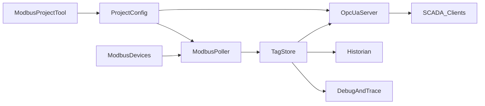

# 02. Архитектура

## Общая схема



Инженерия (проекты карт) отделена от runtime: инструмент `opc-map` готовит и проверяет конфигурацию; процесс сервера загружает уже валидный проект.

## Слои

| Слой | Компоненты | Ответственность |
|------|------------|-----------------|
| Engineering | `ModbusProject`, `opc-map` | Описание устройств и тегов, валидация, генерация узлов UA |
| Southbound | `ModbusPoller`, transport TCP/UDP | Обмен с полевыми устройствами |
| Core | `TagStore`, `Translator`, `Dispatcher` | Актуальные данные, семантика, расписание |
| Northbound | `OpcUaServer` | Сессии UA, Read/Write, Subscriptions |
| Ops | `Historian`, `DebugAndTrace` | Накопление, диагностика, метрики |

## Модули

### ModbusProject / ProjectConfig

- Источник истины для runtime: файл или каталог проекта `*.modbusproj.json`.
- Содержит: сетевые endpoints, slave id, function codes, карты регистров, типы и byte order, имена тегов, группы опроса, права записи, маппинг в дерево OPC UA.
- Загрузчик проверяет JSON Schema до старта poller/UA.

Подробности: [03-modbus-projects.md](03-modbus-projects.md).

### ModbusPoller

- Формирует и отправляет PDU Modbus (сначала TCP, MBAP).
- Парсит ответы, обновляет сырые буферы регистров.
- Таймауты, ретраи, reconnect, учёт exception codes.
- Не знает о SCADA: отдаёт сырые/декодированные значения в `Translator` → `TagStore`.

### Translator

- Декодирование регистров в прикладные типы (`float32`, `uint16`, `bool`, …) с учётом byte/word order.
- `scale` / `offset`, единицы измерения, clamp, enum-метки.
- Обратное кодирование при write-down.
- Семантические алиасы имён для SCADA (логические пути UA).

### TagStore

Единое in-memory хранилище актуальных тегов:

```text
TagId → { value, quality, sourceTimestamp, serverTimestamp, writable, meta }
```

- Потокобезопасные обновления от poller и чтения от UA / historian / debug.
- Устаревание: если устройство не ответило дольше порога — качество → `Uncertain` / `Bad`.

### Dispatcher

- Расписание групп опроса (`fast` / `normal` / `slow`).
- Приоритет write-down над фоновым read при конфликте на одном соединении (политика конфигурируема).
- Изоляция: одно «плохое» устройство не блокирует остальные соединения (per-endpoint workers).

Подробности политик: [06-dispatch-debug-store.md](06-dispatch-debug-store.md).

### OpcUaServer

- Строит Information Model из проекта.
- Отдаёт `DataValue` из `TagStore`.
- Subscriptions / MonitoredItems: уведомления при изменении или по sampling.
- Write → проверка прав → `Dispatcher` write queue → Modbus.

Подробности: [04-opcua-information-model.md](04-opcua-information-model.md).

### Historian

- Hot: кольцевой буфер в RAM на тег или на группу.
- Cold: SQLite / файлы сегментов (или TimescaleDB в расширенном профиле).
- Retention и экспорт/replay для отладки.

### DebugAndTrace

- Лог кадров Modbus (запрос/ответ, RTT, exception).
- События UA-сессий (connect, activate, create subscription).
- Live tag watch и метрики (OpenTelemetry + spdlog).

## Потоки данных

### Чтение (поле → SCADA)

```text
Device --Modbus--> Poller --> Translator --> TagStore
                                              ├--> OpcUaServer --> SCADA
                                              ├--> Historian
                                              └--> DebugAndTrace
```

### Запись (SCADA → поле)

```text
SCADA --UA Write--> OpcUaServer --> TagStore (optimistic / pending)
                                 --> Dispatcher write queue
                                 --> Poller --> Device
                                 --> TagStore (confirm / reject + quality)
```

### Инженерия

```text
Инженер --> opc-map / редактор проекта --> *.modbusproj.json
        --> validate / doctor / gen-nodeset
        --> загрузка ProjectConfig в runtime
```

## Границы ответственности

| Входит в ядро | Не входит в ядро |
|---------------|------------------|
| Modbus TCP(+UDP), TagStore, UA Server | OPC Classic/DA (будущий опциональный адаптер) |
| Проект карт и CLI-валидация | Полноценный GUI SCADA |
| Historian hot/cold базовый профиль | Произвольные облачные data lakes |
| Отладка и метрики | Встроенный PLC runtime |

## Развёртывание процессов

Рекомендуемый профиль v1: **один процесс** с потоками/io_context:

- I/O poller (Asio)
- UA server thread / callbacks
- historian writer
- metrics exporter

Разделение на несколько процессов допустимо позже (отдельный historian), но не требуется на первом этапе.

## Связь с текущим кодом репозитория

Сейчас в репозитории:

- [`Src/app.cpp`](../Src/app.cpp) — загрузка JSON и пустой цикл;
- [`DOCs/config.json`](config.json) — прототип карты;
- submodule `modbuspp` — не ядро целевого стека.

Целевые модули появятся по [07-roadmap.md](07-roadmap.md); имена каталогов исходников рекомендуется выровнять позже (`Src/poller`, `Src/tagstore`, `Src/opcua`, …).
