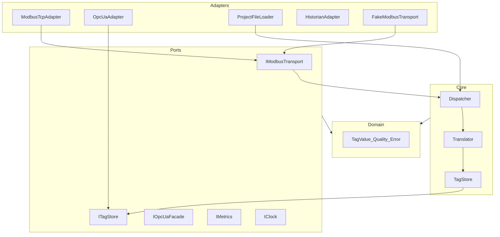
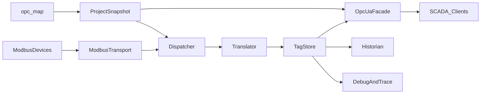

# 02. Архитектура

Нормативные решения: **[ADR](adr/README.md)**. Стандарты кода: **[08-engineering-standards](08-engineering-standards.md)**. Масштаб: **[09-scalability](09-scalability.md)**. Quality gates: **[10](10-quality-gates.md)**.

## Стиль: Ports & Adapters



Инженерия (проекты карт) отделена от runtime: инструмент `opc-map` готовит и проверяет конфигурацию; процесс сервера загружает уже валидный **immutable** snapshot проекта ([ADR-0005](adr/0005-config-immutability.md)).

## Слои

| Слой | Каталог | Ответственность |
|------|---------|-----------------|
| Domain | `Src/domain` | Чистые типы |
| Ports | `Src/ports` | Интерфейсы I/O и времени |
| Core | `Src/core` | Dispatcher, Translator, TagStore |
| Project | `Src/project` | Load/validate/migrate карт |
| Adapters | `Src/adapters` | Asio Modbus, UA, clock, fakes |
| App | `Src/app` | Composition root (`ServerRuntime`, CLI) |
| Engineering | `tools/opc-map` | CLI без runtime poller |

Правило зависимостей — [08](08-engineering-standards.md). Нарушение = блокер merge.

## Общая схема runtime



## Модули

### ModbusProject / ProjectConfig

- Источник истины: `*.modbusproj.json`.
- После load — immutable snapshot.
- Подробности: [03-modbus-projects.md](03-modbus-projects.md).

### Modbus transport + Dispatcher

- `IModbusTransport` — PDU/MBAP, таймауты ([ADR-0007](adr/0007-modbus-transport-port.md)).
- Dispatcher — расписание групп, write queue, strand per endpoint ([ADR-0002](adr/0002-concurrency-model.md)).

### Translator

- Регистры ↔ engineering values; без I/O.

### TagStore

Единый снимок ([ADR-0006](adr/0006-tagstore-data-model.md)):

```text
TagId → { value, quality, sourceTimestamp, serverTimestamp, epoch }
```

### OpcUaFacade

- Модель из `nodePath`; читает только TagStore; write → Dispatcher ([ADR-0009](adr/0009-northbound-opcua-boundary.md)).

### Historian / Debug / Metrics

- [ADR-0008](adr/0008-observability.md), [06](06-dispatch-debug-store.md).

## Потоки данных

### Чтение

```text
Device --> Transport --> Dispatcher --> Translator --> TagStore --> OpcUa / Historian / Debug
```

### Запись

```text
SCADA --> OpcUaFacade --> Dispatcher write queue --> Transport --> Device
                      --> TagStore (confirm/reject)
```

## Связь с кодом

| Путь | Статус |
|------|--------|
| `Src/project/*` | Stage 1 |
| `Src/domain`, `ports`, `core` | Архитектурный каркас + TagStore |
| `adapters/testsupport` | FakeModbusTransport |
| Asio Modbus / open62541 | Stage 2+ |
